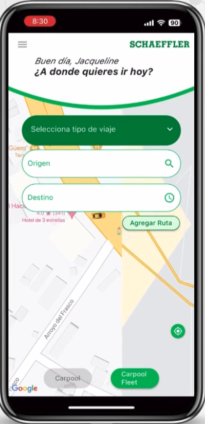
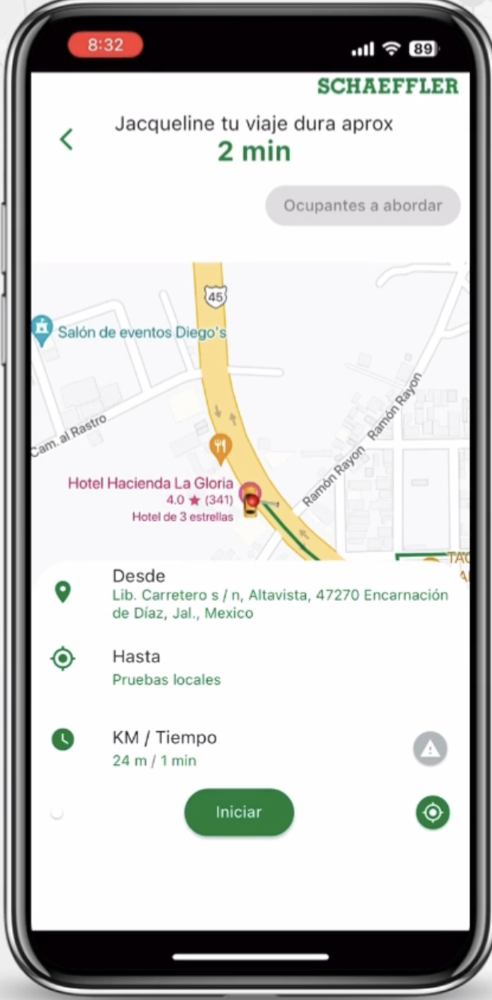
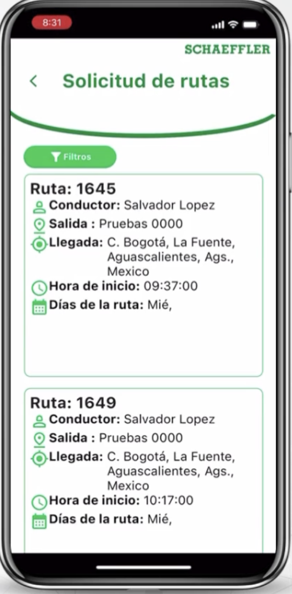
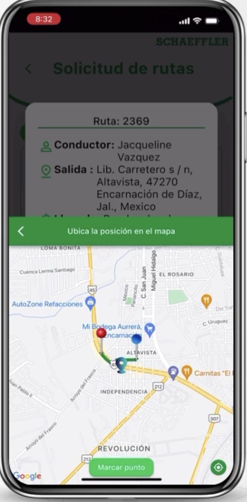
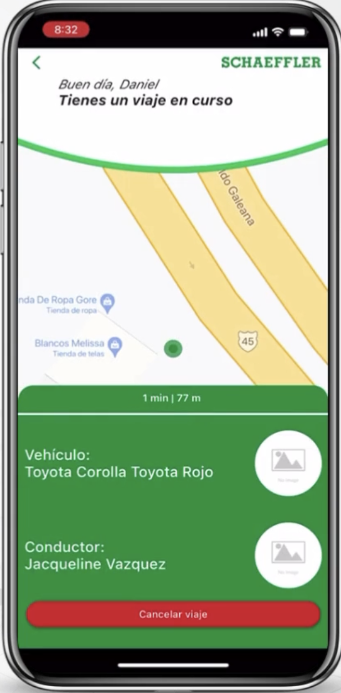

# Carpool

> Carpool is a car sharing app where company employees register as drivers or passengers, drivers create routes, and passengers request to be picked up along that route.

---

## 🚀 Main features

- 🔐 Login and consuming API's rest
- 💬 Push notifications use
- 📱 Responsive UI
- 📦 Stored state app

---

## 🛠️ Tecnologías utilizadas

- Flutter 3.29.3 / Dart 3.7.2
- Firebase Push notifications
- Provider 

---

## 📸 Screenshots

Driver mode

| Home | Route creation | Pick occupant | Finish notification |

 

 

---

Occupant mode

| Travel reques | Select pick up location | Travel tracking pick up | Finish notification |

 

---
