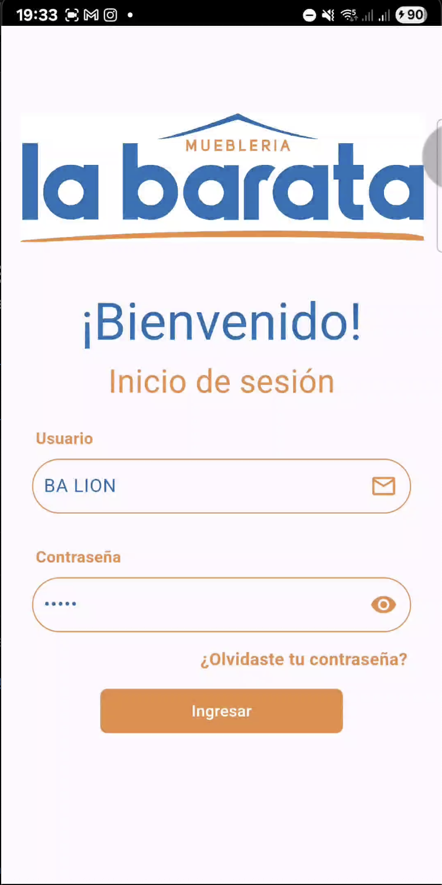
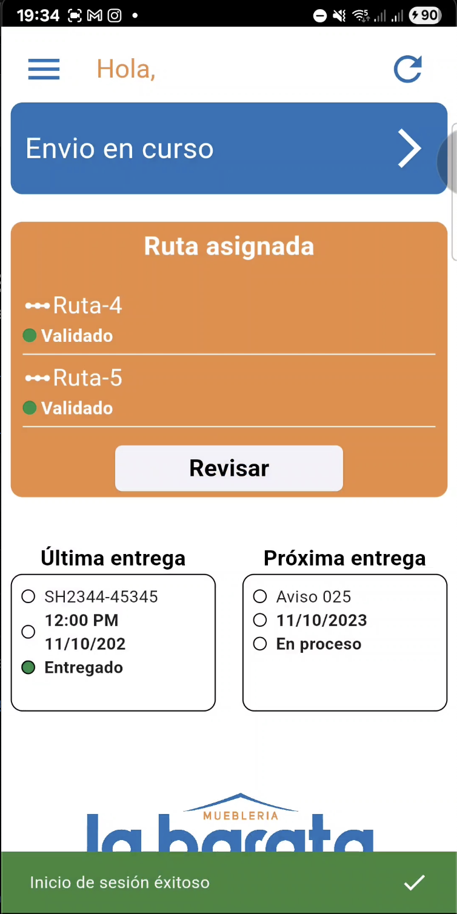
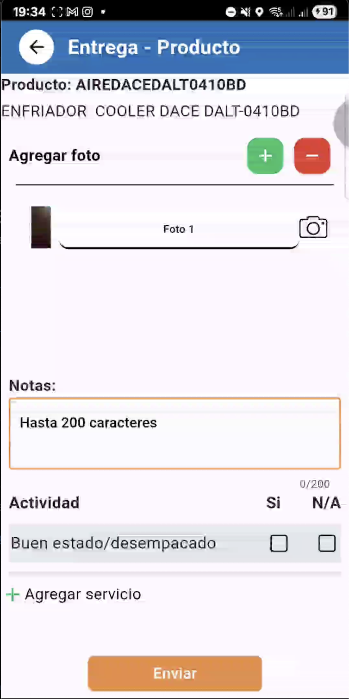
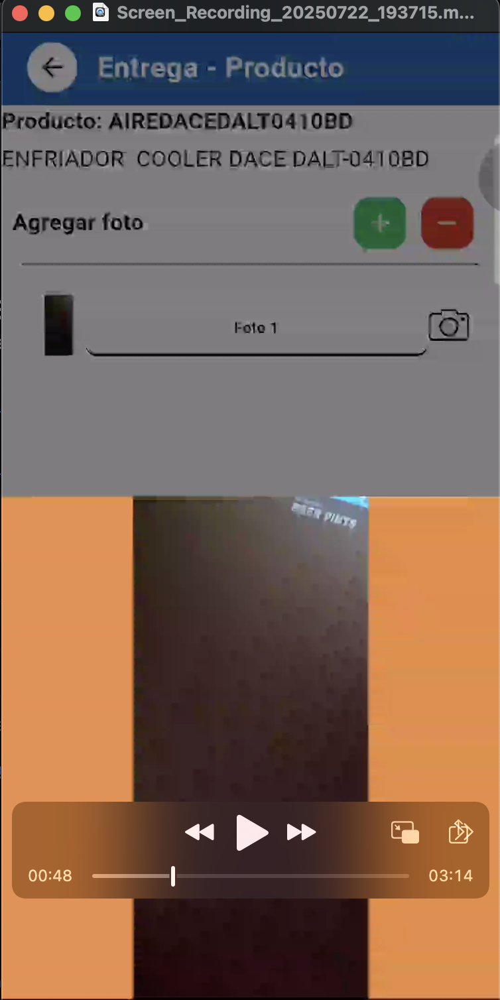
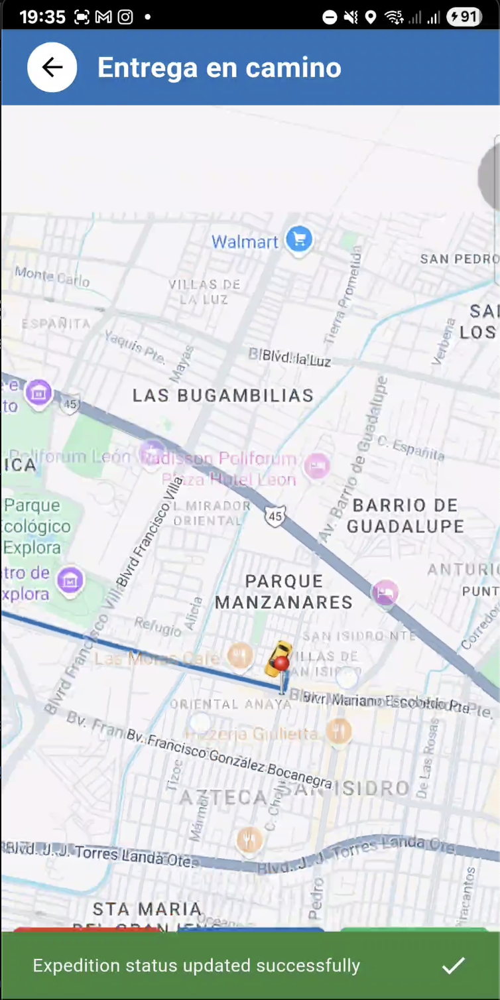

# La barata

> La barata is an application to delivery products, services or notices to a differents clients by differets routes per users.

---

## 🚀 Main features

- 🔐 Login and consuming API's rest
- 💬 Push notifications use
- 📱 Responsive UI
- 📦 Stored state app

---

## 🛠️ Tecnologías utilizadas

- Flutter 3.29.3 / Dart 3.7.2
- Firebase Push notifications
- Provider 

---

## 📸 Screenshots

| Login | Home | Delivery evidence | Map navigationn |

 
 
 

---