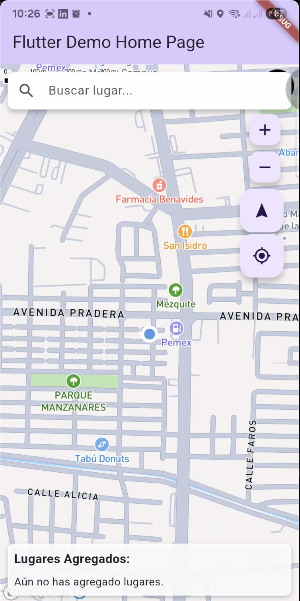

# Mapbox kit navigation

> Mapbox kit navigation is a library building using flutter and dart to simulate a navigation using mapbox, this create a route between few locations and use voice commands to speak instructions to arrive to your destination, while travel this route the last segment dissapear from the screen

---

## 🚀 Main features

- Use Mapbox map
- Use mapbox directions
- Use mapbox search

---

## 🛠️ Tecnologías utilizadas

- Flutter 3.29.3 / Dart 3.7.2
- Firebase Push notifications
- Mapbox 

---

## 📸 Screenshots

| Map Screen | Search places | Places informatio | Drawed route |

 
 
 

---